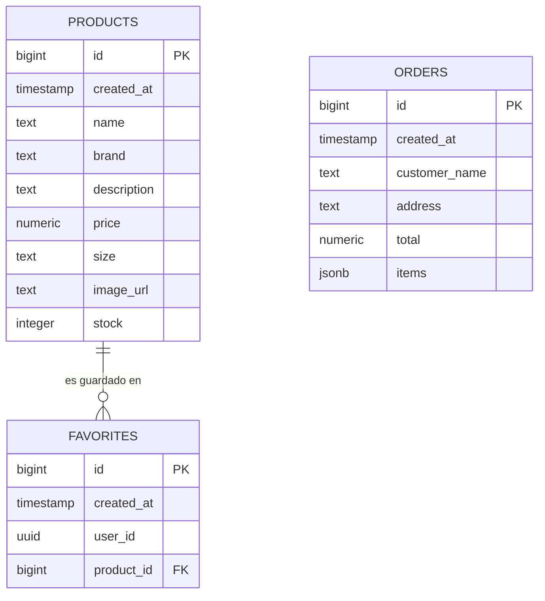
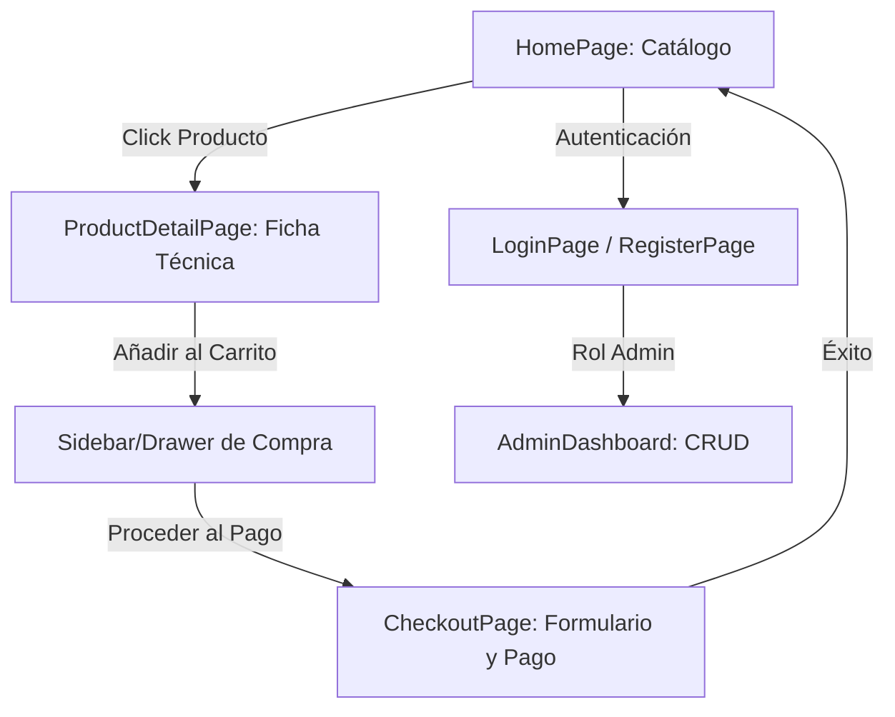

# MEMORIA TÉCNICA: PROYECTO FIN DE GRADO (DAW)
## DESARROLLO DE LA PLATAFORMA DE COMERCIO ELECTRÓNICO DE STREETWEAR "SNEAK-OUT"

---

### I. IDENTIFICACIÓN Y SÍNTESIS DEL PROYECTO

#### Portada
* **Título del Proyecto:** SNEAK-OUT: Plataforma de Comercio Electrónico Especializada en Calzado de Streetwear
* **Nombre del Estudiante:** [Tu Nombre Completo]
* **Email:** [Tu Correo Electrónico]
* **Nombre del Centro:** [Nombre del Centro de Estudios]
* **Nombre del Tutor:** [Nombre del Tutor del Proyecto]
* **Ciclo Formativo:** Desarrollo de Aplicaciones Web (DAW)
* **Fecha de Entrega:** [Fecha de Entrega]

---

#### Resumen
El presente proyecto expone el diseño, desarrollo e implementación de "SNEAK-OUT", una plataforma web de comercio electrónico especializada en calzado y moda urbana (*streetwear*). La aplicación se compone de una arquitectura robusta y moderna dividida en un cliente ágil desarrollado en React y Vite, y una infraestructura *Backend-as-a-Service* (BaaS) provista por Supabase, utilizando PostgreSQL como motor de base de datos relacional. 

El principal enfoque técnico del proyecto radica en la optimización extrema de la experiencia del usuario (UX) y del rendimiento en el lado del cliente. Se ha implementado un sistema avanzado de carga sincronizada mediante el cual las imágenes de los productos se pre-cargan de forma nativa antes de renderizarse, eliminando por completo el parpadeo de pantalla y los desplazamientos bruscos de diseño (*layout shift*). Este sistema se apoya en animaciones de esqueleto (*skeleton loading*) sincronizadas con un temporizador de retardo de seguridad (mínimo de 800 ms) para garantizar transiciones fluidas. Asimismo, la plataforma cuenta con un módulo completo de administración (CRUD) que permite gestionar el catálogo, el control dinámico de inventario y la analítica básica de ventas en tiempo real, todo ello protegido mediante políticas de seguridad a nivel de fila (RLS) y autenticación JWT.

#### Abstract
This project presents the design, development, and implementation of "SNEAK-OUT," an e-commerce web platform specialized in streetwear footwear. The application consists of a robust and modern architecture split into an agile client-side application developed with React and Vite, and a Backend-as-a-Service (BaaS) infrastructure powered by Supabase, using PostgreSQL as the relational database engine.

The core technical focus of the project lies in the extreme optimization of user experience (UX) and client-side performance. A synchronized loading system has been implemented, preloading product images natively before rendering them to eliminate screen flickering and layout shifts. This system is supported by skeleton loading animations synchronized with a safety delay timer (minimum of 800 ms) to ensure fluid transitions. Furthermore, the platform includes a complete administrative module (CRUD) that allows catalog management, dynamic inventory control, and real-time basic sales analytics, all secured using Row-Level Security (RLS) policies and JWT authentication.

---

### II. INTRODUCCIÓN Y ANÁLISIS DE MERCADO

#### 1. Presentación y Justificación
En la última década, el mercado del calzado y la cultura del *streetwear* han experimentado un crecimiento sin precedentes, pasando de ser un nicho de subculturas urbanas a convertirse en una industria multimillonaria altamente competitiva. Las plataformas de comercio electrónico generalistas a menudo carecen de la estética, la velocidad y la especialización que demanda este perfil de cliente exigente, caracterizado por una alta afinidad tecnológica y una gran atención al detalle visual.

La decisión de desarrollar "SNEAK-OUT" responde a la necesidad de crear una solución de *e-commerce* premium que combine un rendimiento técnico sobresaliente con una interfaz de usuario minimalista y de alto impacto visual. El proyecto justifica su desarrollo al abordar problemas comunes en las tiendas web tradicionales, tales como la carga progresiva y asíncrona no controlada de imágenes de alta resolución, la falta de fluidez en los estados de carga y la rigidez de los flujos de navegación.

#### 2. Análisis de la Situación
En el contexto tecnológico actual, los usuarios finales asocian la lentitud de carga con la falta de fiabilidad de un negocio. Las grandes plataformas del sector (como Nike SNKRS, StockX o Goat) han establecido estándares muy altos en cuanto a diseño y rapidez. El análisis de soluciones similares revela que muchas de las alternativas de código abierto (como WooCommerce o PrestaShop) sufren de sobrecarga de scripts (*bloatware*), lo que incrementa el tiempo de primera interacción (TTI).

"SNEAK-OUT" se desmarca de estas soluciones tradicionales adoptando una arquitectura de Single Page Application (SPA) desacoplada. Se utiliza React como biblioteca para la interfaz y Vite como herramienta de empaquetado de última generación, logrando que los tiempos de respuesta del cliente sean prácticamente instantáneos gracias a la ausencia de recargas de página completas y al uso de un servidor de desarrollo optimizado.

#### 3. Público Objetivo
El público objetivo de la plataforma se compone principalmente de jóvenes de entre 16 y 35 años, entusiastas de la moda urbana, coleccionistas de zapatillas (*sneakerheads*) y usuarios nativos digitales. Este perfil presenta las siguientes particularidades:
* **Perfil Tecnológico:** Alto. Utilizan dispositivos móviles de última generación y esperan transiciones de software nativo en la web.
* **Contexto de Uso:** Mayoritariamente multidispositivo (móvil y escritorio). El flujo de compra debe ser lo suficientemente ágil para completarse en menos de un minuto desde el dispositivo móvil.
* **Exigencia Estética:** Elevada. Tolerancia mínima a layouts desalineados, tipografías estándar de navegador o recursos gráficos de baja calidad (como emojis genéricos en botones de acción).

---

### III. PROPUESTA TÉCNICA

#### 4. Objetivos del Proyecto
El proyecto se estructura bajo la meta de entregar un software de producción robusto que cumpla con los estándares académicos y profesionales de DAW.

##### Mínimo Producto Viable (MVP)
* **Autenticación Segura:** Registro e inicio de sesión integrados mediante proveedor de identidad (Supabase Auth).
* **Catálogo Dinámico:** Visualización del inventario de productos en cuadrículas adaptables, con filtrado y búsqueda en tiempo real.
* **Detalle del Producto:** Vista extendida con selector de tallas dinámico y carga de múltiples imágenes secundarias.
* **Flujo de Compra Completo:** Carrito de compras persistente a nivel de sesión y pasarela de simulación de pedidos (*checkout*).

##### Funcionalidades Extra (Valor Añadido)
* **Panel de Control Administrativo (Backoffice):** Interfaz completa para la creación, lectura, edición y eliminación de productos (CRUD), control de stock físico y analíticas.
* **Sistema de Favoritos:** Persistencia en base de datos para almacenar los productos guardados por el usuario.
* **Optimización de Renderizado:** Precarga asíncrona de imágenes en caché de navegador y transiciones dinámicas basadas en Skeleton Loaders.
* **Diseño sin Emojis:** Interfaz 100% vectorizada mediante el uso exclusivo de librerías de iconos estandarizadas (`lucide-react` y `react-icons`).

---

#### 5. Stack Tecnológico y Arquitectura

##### Justificación de Tecnologías
* **Frontend (React.js & Vite):** React proporciona un modelo declarativo basado en componentes reutilizables y un DOM virtual que optimiza las actualizaciones visuales. Vite sustituye a herramientas heredadas como Webpack, acelerando drásticamente el tiempo de compilación y optimizando los bundles finales de producción a través de Rollup.
* **Infraestructura Backend-as-a-Service (Supabase):** Supabase ofrece una base de datos PostgreSQL completa sin la sobrecarga administrativa de un servidor dedicado. Además, proporciona de manera integrada servicios de autenticación de nivel empresarial, almacenamiento de objetos (Storage) y APIs REST autogeneradas a través de PostgREST.
* **Base de Datos (PostgreSQL):** Base de datos relacional de código abierto que asegura la integridad referencial de los datos y permite consultas complejas, indispensable para la gestión de productos, inventario y relaciones de favoritos de los usuarios.

##### Arquitectura del Sistema
La aplicación se organiza bajo una estructura modular de carpetas en el cliente, promoviendo el desacoplamiento de responsabilidades y la reusabilidad del código:

```text
/src
 ├── /components       # Componentes visuales reutilizables (Cards, Skeletons, Footer)
 ├── /context          # Proveedores de estado global (AuthContext, CartContext)
 ├── /pages            # Vistas principales de la aplicación (Home, Detail, Checkout, Admin)
 ├── /services         # Capa de abstracción y llamadas a servicios externos (api.js)
 ├── /supabaseClient   # Configuración y cliente de conexión con Supabase
 ├── index.css         # Sistema de diseño, tokens de CSS y variables globales
 └── main.jsx          # Punto de entrada de la aplicación
```

##### Diagrama Entidad-Relación y Persistencia de Datos
La persistencia de datos se gestiona mediante tres tablas principales en PostgreSQL altamente normalizadas:



* **Tabla `products`:** Almacena la información de catálogo. La columna `size` guarda las tallas disponibles como texto separado por comas para flexibilizar la carga, y `stock` representa la cantidad física actual.
* **Tabla `favorites`:** Tabla de relación que asocia la clave única del usuario (`user_id` de Supabase Auth) con la clave primaria del producto (`product_id`).
* **Tabla `orders`:** Registra las transacciones completadas, almacenando la información del cliente y los productos comprados estructurados en formato JSON binario (`jsonb`) para optimizar el rendimiento y la flexibilidad de lectura.

##### Conexión y Seguridad
La comunicación entre el cliente y el servidor se realiza mediante llamadas HTTPS asíncronas haciendo uso del cliente SDK oficial de Supabase.
* **Gestión de CORS:** Supabase gestiona de forma automática los encabezados CORS, estando configurado para aceptar únicamente peticiones procedentes de dominios autorizados en el entorno de desarrollo y producción.
* **Sistema de Autenticación:** Se utiliza un flujo basado en JSON Web Tokens (JWT). Cuando el usuario inicia sesión, Supabase genera un token JWT firmado que se almacena en el cliente. Este token es enviado de forma automática en las cabeceras de cada petición asíncrona para validar la identidad en el servidor.
* **Políticas de Seguridad a Nivel de Fila (RLS):** Se han definido reglas estrictas a nivel de base de datos para impedir accesos no autorizados. Por ejemplo, en la tabla `favorites`, se aplica una directiva RLS que solo permite operaciones de lectura, inserción y borrado si el `user_id` del registro coincide exactamente con el ID codificado en el JWT del usuario autenticado:
  ```sql
  create policy "Users can only modify their own favorites"
  on public.favorites for all
  using (auth.uid() = user_id);
  ```

---

### IV. DESARROLLO Y DISEÑO

#### 6. Desarrollo Táctico
El ciclo de vida del desarrollo se estructuró bajo una metodología ágil iterativa inspirada en Scrum, dividiendo la carga de trabajo en tres Sprints principales:
* **Sprint 1 (Cimientos e Infraestructura):** Modelado de la base de datos en Supabase, configuración de las directivas RLS, desarrollo de los contextos globales de React (`AuthContext` y `CartContext`) y maquetación de las vistas base.
* **Sprint 2 (Funcionalidad y CRUD):** Integración de las operaciones CRUD del panel de administración, lógica de inserción de pedidos, persistencia de favoritos y sistema de registro/login de usuarios.
* **Sprint 3 (Optimización de Rendimiento y Pulido de UX):** Implementación de la precarga asíncrona de imágenes, integración de Skeleton Loaders, eliminación de emojis en favor de iconos vectoriales y realización de pruebas de integración.

La gestión del código fuente se llevó a cabo utilizando **Git** como sistema de control de versiones distribuido, manteniendo una rama principal `main` para código de producción y ramas de características auxiliares (`feature/`) para asegurar el desarrollo aislado.

#### 7. Diseño y UX

##### Guía de Estilo y Paleta de Colores
El diseño de "SNEAK-OUT" proyecta una estética minimalista, limpia e industrial muy afín al sector de las zapatillas de gama alta. Se ha diseñado un sistema de temas basado enteramente en **variables CSS personalizadas (tokens)**, facilitando la escalabilidad visual:

```css
:root {
  --color-base: #F9F6F0;      /* Color de fondo primario (off-white) */
  --color-raised: #F0EDE4;    /* Fondo secundario para tarjetas y elementos elevados */
  --color-accent: #000000;    /* Color de contraste principal (negro industrial) */
  --color-accent-hover: #222; /* Color de realce para interacciones */
  --color-muted: #7E7C75;     /* Color de texto secundario y bordes */
  --color-border: #E4E1D8;    /* Bordes de división sutiles */
}
```

* **Tipografía:** Se ha utilizado la fuente de Google Fonts **"Inter"** (sans-serif) para el cuerpo del texto por su legibilidad, y variantes ultra negritas para los títulos principales, aportando un carácter tipográfico fuerte e industrial.
* **Defensa Técnica del Diseño:** La selección cromática en tonos arena y negro industrial evita la distracción y cede todo el protagonismo visual al colorido de los productos y sus imágenes. Las interacciones con botones cuentan con micro-transiciones suaves (`transition: all 0.2s ease`).

##### Flujo de Navegación del Usuario
El mapa de navegación está optimizado para facilitar la conversión comercial:



---

#### 8. Mecanismos de Control

##### Plan de Pruebas (Testing)
El control de calidad se ha realizado mediante pruebas de caja negra a nivel de integración y de interfaz de usuario para verificar los siguientes flujos críticos:
1. **Flujo de Compra Completo:** Simulación de adición de múltiples artículos de distintas tallas, validación del cálculo correcto del importe total y persistencia al recargar el navegador.
2. **Gestión de Stock:** Intento de compra de artículos cuyo inventario es cero (el botón de adición se deshabilita automáticamente y muestra "Agotado").
3. **Flujo Administrativo:** Inserción de un nuevo producto mediante el panel de control y validación de su reflejo inmediato en el catálogo de cara al usuario final.

##### Validaciones de Formularios e Integridad
* **Validación en Cliente:** Los formularios (creación de producto, registro de usuario y datos de envío) cuentan con restricciones HTML5 nativas (`required`, tipos de datos específicos) complementadas con validaciones lógicas en JavaScript (como la confirmación estricta de coincidencia de contraseñas antes del envío al backend).
* **Gestión de Errores:** Las llamadas al backend están envueltas en bloques de control de excepciones `try-catch`. Cualquier error devuelto por la API de Supabase se captura y se muestra al usuario mediante mensajes emergentes amigables no intrusivos (`react-hot-toast`), evitando caídas de ejecución en el cliente.

---

### V. CONCLUSIONES Y CIERRE

#### 9. Conclusiones e Implicaciones de Negocio
El desarrollo de "SNEAK-OUT" demuestra la viabilidad técnica de crear una plataforma de comercio electrónico de alta fidelidad visual y rendimiento sobresaliente sin incurrir en costes de infraestructura complejos, gracias al paradigma Serverless y al uso de servicios BaaS como Supabase. 

Desde la perspectiva del negocio, las decisiones de optimización UX —tales como la eliminación del parpadeo de carga mediante la sincronización del ciclo de vida del componente con la precarga de imágenes y los Skeleton Loaders— tienen un impacto directo y cuantificable en la retención del cliente en el sitio web y, en última instancia, en el incremento de la tasa de conversión de la plataforma.

#### 10. Limitaciones y Futuras Líneas
A pesar de la solidez técnica alcanzada en el MVP, se reconocen áreas de mejora destinadas a futuras fases de expansión del software:
* **Integración de Pasarela de Pago Real:** Sustituir la simulación de pedidos por una integración real con servicios de procesamiento de pagos con cumplimiento PCI-DSS (como Stripe o PayPal).
* **Sistema de Notificaciones Automatizadas:** Implementar disparadores en el servidor (*Database Webhooks*) para el envío automático de confirmaciones de compra por correo electrónico mediante servicios externos.
* **Sistema de Recomendación Basado en Datos:** Utilizar modelos analíticos sencillos para sugerir productos relacionados en base a las preferencias y el historial de navegación individual del usuario.

---

#### 11. Anexos

##### Fragmento de Código Crítico: Sistema de Precarga Sincronizada con Retardo de Seguridad
A continuación, se adjunta la lógica clave implementada en [HomePage.jsx](file:///home/sergio/Escritorio/Proyecto-final-grado-DAW/src/pages/HomePage.jsx) que garantiza la visualización simultánea de todos los productos y un comportamiento óptimo del esqueleto de carga:

```javascript
// Función para obtener productos y precargar sus imágenes de forma síncrona
const fetchProducts = async (searchQuery = '') => {
  setLoading(true);
  try {
    const params = {};
    if (searchQuery) params.search = searchQuery;
    const res = await getProducts(params);
    const productsData = res.data || [];

    // 1. Mapeo de promesas para precargar cada recurso gráfico en el navegador
    const preloadPromises = productsData.map(product => {
      const { data: imgData } = supabase.storage
        .from('Images')
        .getPublicUrl(`${product.image_url}/0.png`);
      const imageUrl = imgData?.publicUrl;

      if (!imageUrl) return Promise.resolve();
      return new Promise((resolve) => {
        const img = new Image();
        img.src = imageUrl;
        img.onload = resolve;
        img.onerror = resolve; // Se resuelve en cualquier caso para no bloquear la app
      });
    });

    // 2. Control asíncrono combinado:
    //    - Espera a que terminen las imágenes (con un timeout máximo de 3 segundos)
    //    - Garantiza un mínimo de 800ms de visualización del Skeleton para evitar parpadeos
    await Promise.all([
      Promise.race([
        Promise.all(preloadPromises),
        new Promise(resolve => setTimeout(resolve, 3000))
      ]),
      new Promise(resolve => setTimeout(resolve, 800))
    ]);

    setProducts(productsData);
  } catch (err) {
    console.error(err);
  } finally {
    setLoading(false);
  }
};
```

Este fragmento ejemplifica cómo la asincronía en JavaScript se puede orquestar para someter el flujo de la UI a criterios estrictos de experiencia de usuario, asegurando una transición visual suave e impecable.
